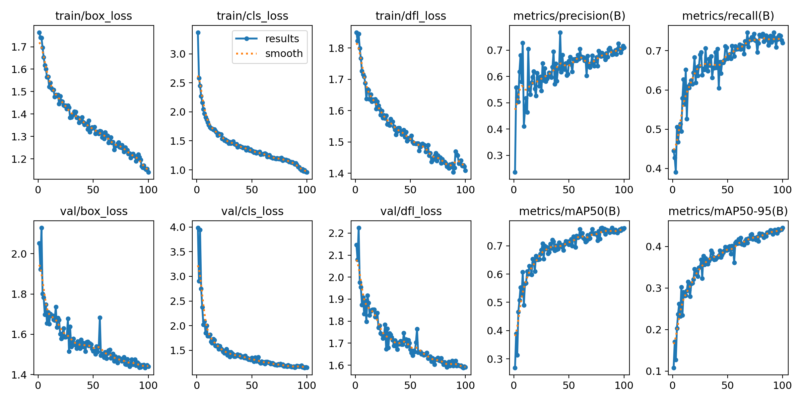
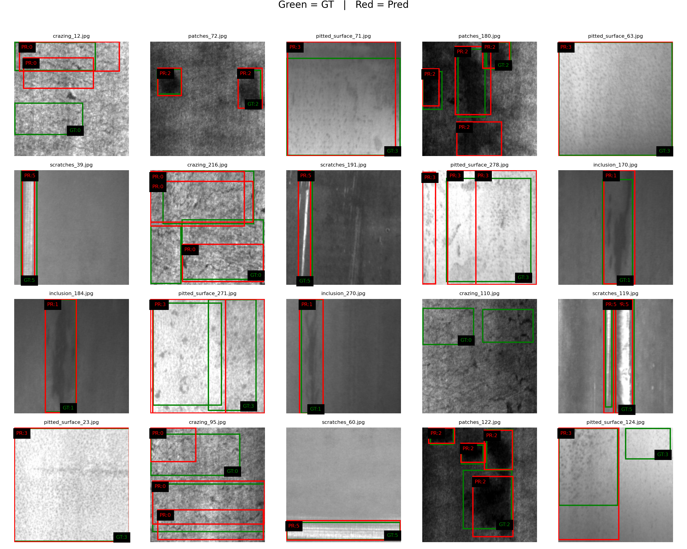

# Metal Surface Defect Detection with YOLOv11

This repository implements an end-to-end pipeline for **detecting surface defects on metal strips using deep learning**.  
The project uses **YOLOv11** (Ultralytics) to locate and classify defects on steel surfaces.

---

## Dataset

The dataset used is the **NEU Metal Surface Defects Database**, accessed via Kaggle:

🔗 https://www.kaggle.com/datasets/kaustubhdikshit/neu-surface-defect-database

The original dataset contains:

- **1,800 grayscale images** (200×200 px)
- **6 defect classes**:
  - `crazing (Cr)`
  - `inclusion (In)`
  - `patches (Pa)`
  - `pitted_surface (PS)`
  - `rolled-in_scale (RS)`
  - `scratches (Sc)`
- Each image comes with a **VOC XML annotation** describing a bounding box around the defect.

This dataset was created by the **NEU (Northeastern University, China)** research group and represents typical **hot-rolled steel surface defects**.

---

## Practical Applications

This type of computer vision system is directly applicable to:

- **Automated quality inspection** in steel and metal manufacturing
- **Real-time defect detection on production lines**
- **Reducing manual inspection time and cost**
- **Predictive maintenance** through monitoring defect distributions
- **Increasing consistency and reliability** in industrial QA processes

Since many industrial inspection systems require real-time processing, YOLO is an ideal choice thanks to its high inference speed and ability to maintain high frame rates even on lightweight hardware.

---

## Data Preparation & Inspection

### `dataset_preparation.py`
This script prepares the dataset for YOLO training.  
It performs the following steps:

#### 1. Collect original images + XML annotations  
The Kaggle version of NEU-DET is split into `train/` and `validation/` folders.  
The script loads **all XML files and images** from both splits.

#### 2. Shuffle data  
All samples are combined and randomly shuffled using a fixed seed to ensure reproducibility.

#### 3. Re-split into train / val / test  
The dataset is redistributed into:
- **train (75%)**
- **val (15%)**
- **test (10%)**

#### 4. Convert XML → YOLO label format  
For each sample:
- XML bounding boxes (`xmin, ymin, xmax, ymax`)  
- are converted into YOLO format:

---

### `data_inspection.ipynb`
This notebook is used to visually inspect the dataset after conversion.

It performs:

### Random Sampling
Selects **12 random images** from the training set.

### Bounding Box Rendering
- Reads the `.txt` YOLO labels  
- Converts normalized coordinates back into pixel coordinates  
- Draws bounding boxes and class names on each sample  

### Purpose
- Validate that the dataset preparation step was correct  
- Understand how each defect type appears visually  
- Check for annotation issues (bad labels, wrong classes, etc.)

This is an useful step before model training.

---

## Model Training & Evaluation

### `model_training.ipynb`

This notebook trains a YOLOv11 model on the prepared dataset.

#### Model Used: **YOLOv11n**
- **“Nano” version of YOLOv11**  
- **~2.5M parameters**  
- Extremely **fast and lightweight**  
- Designed for **real-time inference**, even on mid-range GPUs   
- Efficient enough for **edge deployment** and industrial systems requiring high throughput  

#### Training Pipeline Summary

The training workflow is handled almost entirely by the **Ultralytics YOLO** framework, which automates most steps such as metric computation, logging, plotting, and exporting results. Only the core hyperparameters needed to be configured, while YOLO manages the rest internally.

The final configuration shown here is the result of testing a few different parameter combinations (e.g., varying epochs, image size, and model variant). The settings below correspond to the **best-performing configuration** used to produce the final results.

1. **Load pretrained COCO weights** (`yolo11n.pt`)  
   YOLO automatically initializes the model and loads pretrained backbone weights.

2. **Train on NEU-DET using:**  
   - `epochs = 100`  
   - `batch_size = 4` (limited by 4 GB GPU memory)  
   - `imgsz = 640`  
   - All other parameters kept at YOLO defaults  
   YOLO automatically performs data loading, augmentation, batching, backpropagation, model updates, and logging.

3. **Track training curves automatically generated by YOLO:**  
   - `box_loss`  
   - `cls_loss`  
   - `dfl_loss`  
   - Precision, Recall  
   - mAP@0.5, mAP@0.5–0.95  

4. **Evaluate using standard object detection metrics** (computed automatically each epoch):  
   - **Precision**  
   - **Recall**  
   - **mAP@0.50**  
   - **mAP@0.50–0.95**

5. **Generate diagnostic outputs:**  
   - Confusion matrix  
   - Per-class Average Precision (AP) scores  
   - Visualizations of predicted bounding boxes  
   YOLO creates and saves all plots automatically under the `runs_yolo11/` directory.

6. **Export trained weights:**  
   - `last.pt` – model checkpoint after final epoch  
   - `best.pt` – model with highest validation performance  

The resulting model can be used to perform real-time detection of surface defects on new metal images, providing both bounding boxes and class predictions.

---

### `model_evaluation_inference.py`

This script evaluates the final YOLOv11 model and prints the **best** and **latest** performance metrics on both the validation and test sets.

#### 1. Load Trained Weights  
The file automatically loads the two model checkpoints generated during training:
- **`best.pt`** — model with highest validation mAP  
- **`last.pt`** — model after the final training epoch  

Each weight file is evaluated separately so we can compare their performance.

#### 2. Validate Model Performance  
For both `best.pt` and `last.pt`, the script runs YOLO's built-in validation pipeline and prints:
- **Precision**
- **Recall**
- **mAP@0.5**
- **mAP@0.5–0.95**

These metrics help assess how well the model detects and localizes defects on images it has already “seen” during training.

#### 3. Test Set Evaluation  
After validating, the script evaluates **`best.pt`** on the **test split**, giving a realistic measure of the model’s generalization capability on previously unseen data.

The same metrics (Precision, Recall, mAP) are reported.

Since the final training epoch achieved the highest validation performance, the `best.pt` and `last.pt` checkpoints are identical, which means that the model converged smoothly and its best results occurred at the final epoch.

## Results

> **Note:** The results presented here are not necessarily the highest achievable on the NEU-DET dataset. This project uses the **smallest YOLOv11 model (YOLO11n)**, which prioritizes speed and low memory usage over maximum accuracy. Additional factors such as limited GPU VRAM, relatively short training time, default augmentations, and minimal hyperparameter tuning may also affect the final performance.  

>However, the goal of this project was not to achieve state-of-the-art results, but rather to **learn and explore the complete workflow of object detection, dataset preparation, transfer learning, and evaluation using YOLO**. In that regard, the results are more than sufficient and demonstrate a solid understanding of the full object-detection pipeline.

### Training Curves & Metrics

  
  
<em>YOLOv11n training curves</em>

### **Final Model Performance**

| **Metric**      | **Validation Set** | **Test Set** |
|------------------|----------------|----------|
| **Precision**    | 0.7079    | 0.7824|
| **Recall**       | 0.7207   | 0.6850 |
| **mAP@0.50**     | 0.7620   | 0.7765|

### Results Interpretation & Next Steps

The training and validation curves show a smooth and consistent decrease in all losses (box, classification, and DFL), which indicates that the model learned effectively without signs of overfitting. Precision, recall, and mAP steadily improve throughout training, with the final model achieving strong performance for a lightweight YOLOv11n network:

- **Validation:** mAP@0.50 ≈ 0.76  
- **Test:** mAP@0.50 ≈ 0.78  
- **Precision/Recall:** ~0.70–0.78 range  

These are solid results given that the NEU-DET defects are small, grayscale, and often low-contrast, and considering that YOLOv11n is the *smallest* and fastest model in the YOLO family.

Although the performance is already good, several improvements could further enhance accuracy:

- **Use a larger model (YOLO11s or YOLO11m):**  
  Larger models can learn more complex textures and typically boost mAP.

- **Increase image resolution (e.g., 768 or 960):**  
  Helps detect very small or thin defects and improves bounding-box accuracy.

- **Stronger data augmentation:**  
  More variety (mosaic, mixup, color jitter) can improve robustness on this small dataset.

- **Train for more epochs:**  
  The curves show the model was still improving at the end of training.

Overall, the model provides reliable defect detection, and the pipeline demonstrates a complete and effective application of YOLO-based object detection on industrial surface-inspection data.

---

## Test Set Visualization

To better understand the model’s performance, the following figure shows **20 random test images** with both **ground-truth** (green) and **predicted** (red) bounding boxes.  
This helps visually evaluate how well the model localizes defects and whether it correctly classifies each defect type.

  
  
<em>Green = Ground Truth | Red = Model Prediction</em>

<!-- ### Metrics Interpretation

This section explains the key evaluation metrics used to assess the YOLOv11 model on the NEU Metal Surface Defects dataset.  
The metrics come directly from Ultralytics’ validation plots and represent standard object-detection evaluation criteria.  
Each metric is described along with its meaning, how it is calculated, how to interpret it in practice, and how your model compares to results reported in literature on the **same dataset (NEU-DET)**.

---

#### Summary of Evaluation Metrics

| **Metric** | **What It Means** | **How It’s Calculated** | **Practical Interpretation** | **Validation Result** | **Test Result** | **Good Range (NEU-DET Research)** |
|-----------|-------------------|--------------------------|-------------------------------|----------------------|----------------|-----------------------------------|
| **Precision** | How many predicted defects are actually correct | TP / (TP + FP) | High precision = few false alarms | ~0.70 | _(fill)_ | 0.70–0.90 |
| **Recall** | How many real defects the model successfully detects | TP / (TP + FN) | High recall = model rarely misses a defect | ~0.70 | _(fill)_ | 0.70–0.90 |
| **mAP@0.50** | Average precision at IoU 0.5 | Mean(AP@0.5 over classes) | Measures overall detection quality (lenient IoU) | ~0.74–0.76 | _(fill)_ | 0.78–0.86 |
| **mAP@0.50–0.95** | AP averaged over IoU thresholds 0.50–0.95 | Mean(AP@0.50–0.95) | Strict localization metric; harder to achieve high values | ~0.40–0.45 | _(fill)_ | 0.35–0.55 |
| **Box Loss** | How accurately bounding boxes fit the defect | IoU-based regression loss | Should decrease steadily; low = good localization | ↓ smooth | — | — |
| **Cls Loss** | How well the model distinguishes defect classes | Cross-entropy | Lower is better; high → class confusion | ↓ smooth | — | — |
| **DFL Loss** | Boundary refinement loss | Distribution Focal Loss | Helps the model refine box edges | ↓ smooth | — | — |
| **Per-Class AP** | AP computed for each defect type | Area under PR curve | Shows which defects are easy/hard (crazing/scratches typically hardest) | patches ~0.88, pitted ~0.81, scratches lower | _(fill)_ | Varies widely per class |

---

#### Interpretation Highlights

- **Your mAP@0.50 (~0.75)** is strong for a lightweight **YOLO11n** model  
  → within ~10% of the best published results (~0.85 mAP) on NEU-DET.
- **Your mAP@0.50–0.95 (~0.42)** is excellent given the strict metric and small 200×200 grayscale images.
- **Precision and Recall around ~0.70** indicate a healthy balance between:
  - detecting most defects (high recall)  
  - avoiding false alarms (precision)
- **Hardest classes** in NEU-DET (consistent with papers):
  - **crazing**
  - **scratches**
  - **rolled-in scale**

These defects are thin, low-contrast, or texture-based → challenging even for larger YOLO models.

--- -->

### Benchmarking of Other Models on NEU-DET

This sections summarizes **mAP@0.5** results from peer-reviewed research papers that applied **object detection with bounding boxes** on the [NEU Surface Defect Dataset (NEU-DET)](https://www.kaggle.com/datasets/kaustubhdikshit/neu-surface-defect-database).

>**Note:** Not all papers use a separate test set—some report metrics on validation data. See split info below.

---

#### Summary of Accuracy and Evaluation Splits

| Model           | mAP@0.5 |  Dataset Split (Train/Val/Test) | Evaluation Set | Source |
|------------------|---------|-------------------------------|----------------|--------|
| **YOLOX-s**      | **89.6%** |  80/20/–                      | **Validation** | [Sensors 2022](https://www.mdpi.com/1424-8220/22/24/9926) |
| **YOLOv10n-SFDC**| 85.5%   |  90/10/–                      | **Validation** | [Sensors 2025](https://www.mdpi.com/1424-8220/25/3/769) |
| **MPA-YOLO**     | 81.5%   |  Implied Train/Test split     | **Test**       | [Pattern Recognition 2025](https://doi.org/10.1016/j.patcog.2025.111897) |
| **SLF-YOLO**     | 80.0%   |  **80/10/10**                 | **Test**       | [Scientific Reports 2025](https://doi.org/10.1038/s41598-025-94936-9) |
| **EPSC-YOLO**    | 77.6%   |  70/20/10                     | **Validation** | [Scientific Reports 2025](https://doi.org/10.1038/s41598-025-91930-z) |

## Conclusion

This project provided a complete, hands-on experience with the full workflow of modern object detection using YOLO. Starting from a raw dataset of steel surface defects, I implemented every stage of the pipeline: preparing and restructuring the data, converting annotations, performing exploratory inspection, training a deep learning model with transfer learning, and evaluating its performance using standard detection metrics.

Although the goal was not to achieve state-of-the-art accuracy, the trained YOLOv11n model achieved solid results, especially considering its extremely small size and the limited VRAM available. Most importantly, this project allowed me to develop a deeper understanding of how object detection systems are built, optimized, and assessed. I gained experience with dataset engineering, YOLO training pipelines, real-world evaluation metrics, and the practical challenges of detecting small, texture-based defects.

Overall, the project successfully demonstrates a full end-to-end defect-detection solution and serves as a strong foundation for future work, whether that involves exploring larger YOLO models, more advanced augmentations, or applying similar techniques to other industrial inspection tasks.
